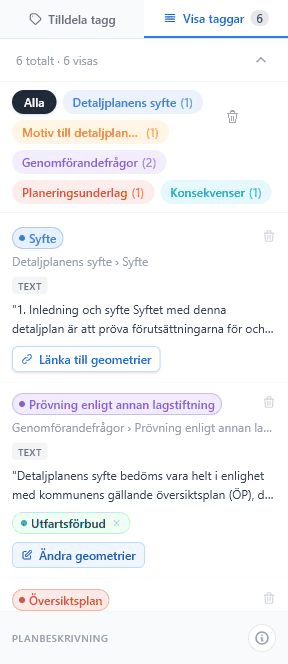

# Sidopanel och taggar

Sidopanelen har två lägen: **Tilldela tagg** och **Visa taggar**.

## Tilldela tagg

Läget visas automatiskt när användaren markerar nytt innehåll. Panelen visar en förhandsvisning av markeringen, kategorisökning, val av tema/grupp/undergrupp och ett noteringsfält.

Plusknappen i sidopanelens nederkant öppnar en dialog för egna kategorier när **Tilldela tagg** är aktiv. Användaren kan skapa en ny grupp under ett befintligt tema eller en ny undergrupp under en befintlig grupp. Det går inte att skapa egna teman.

När en egen kategori sparas uppdateras kategoriträdet direkt i sidopanelen. Den nya kategorin kan väljas, sökas fram och användas för taggar utan att projektet behöver laddas om.

## Visa taggar

Läget listar befintliga taggar i dokumentordning. Användaren kan filtrera på tema, välja tagg, ta bort tagg, länka geometri och avlänka redigerbara geometrier.

*Visa taggar-läget listar dokumentets taggar och åtgärder för varje tagg.*

## Teckenförklaring

Sidopanelens nederkant innehåller en teckenförklaring för temafärger. Den hjälper användaren förstå färgkodningen i dokumentet och tagglistan.
