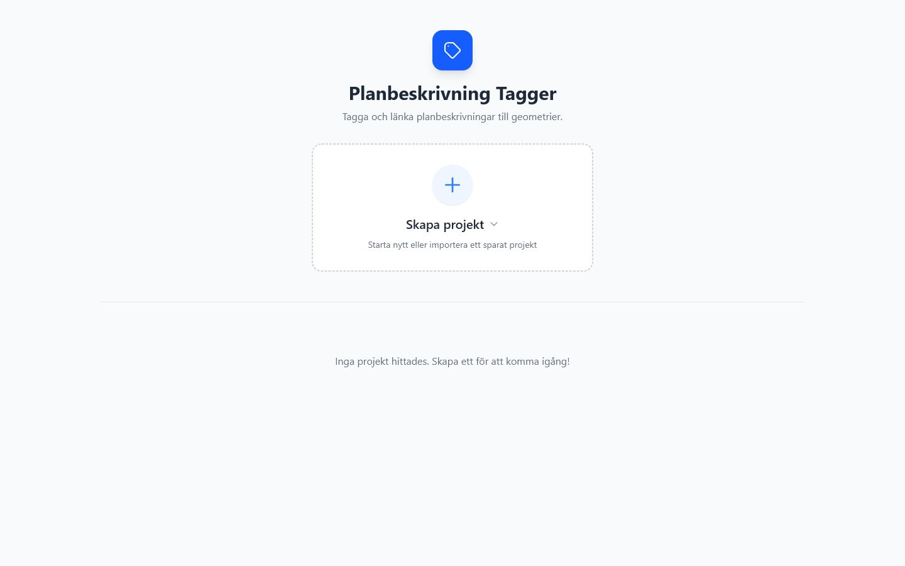
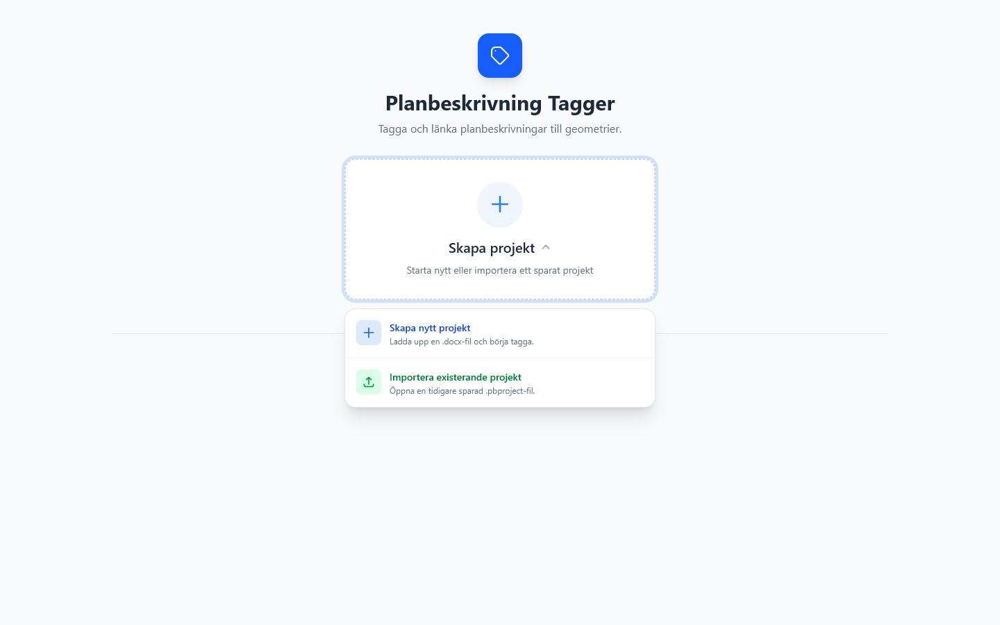

# Start och projektgalleri

Startvyn visas när inget dokument är öppet. Den innehåller en huvudknapp för att skapa eller importera projekt och ett projektgalleri för lokalt sparade projekt.

*Startvyn visar lokalt sparade projekt och ingången för att skapa eller importera projekt.*

## Skapa projekt-knappen

Knappen öppnar en meny med två val:

- **Skapa nytt projekt** öppnar en modal där användaren väljer `.docx` och eventuell `.json`.
- **Importera existerande projekt** öppnar filväljare för `.pbproject`.

*Skapa projekt-menyn samlar nytt projekt och import av befintlig `.pbproject`.*

## Projektgalleri

Projektgalleriet visar sparade projekt från IndexedDB. Varje kort visar projektnamn, senaste uppdatering och antal taggar. Vid hovring visas även projektskapandedatum och antal geometrier.

## Lokal lagring

Projekt sparas lokalt i webbläsaren. Det gör det snabbt att återuppta arbete, men är inte en ersättning för arkivering. För portabel lagring används `.pbproject`.
