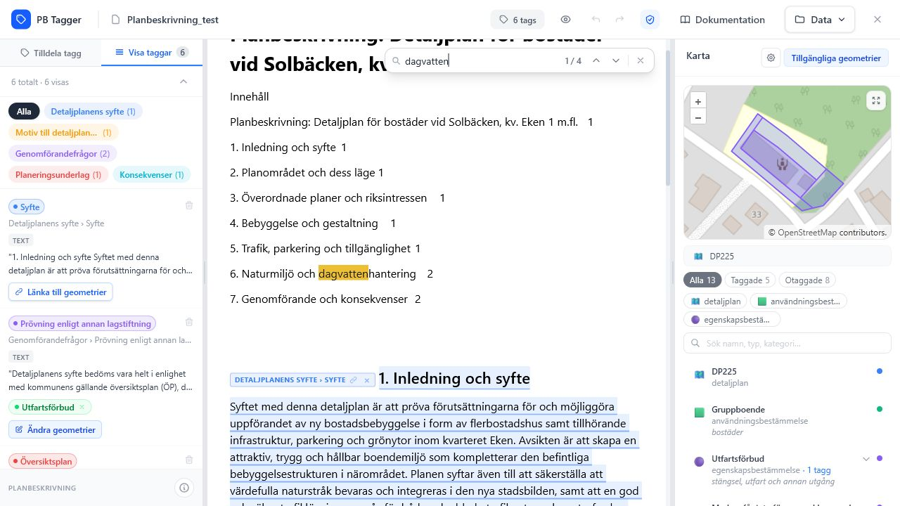
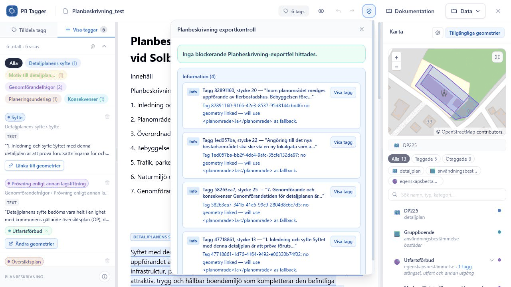
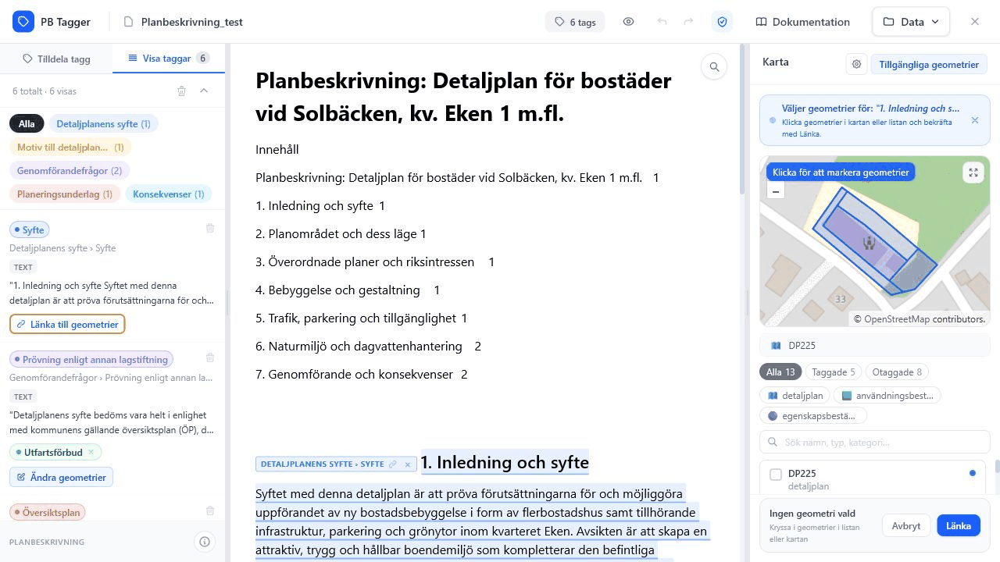
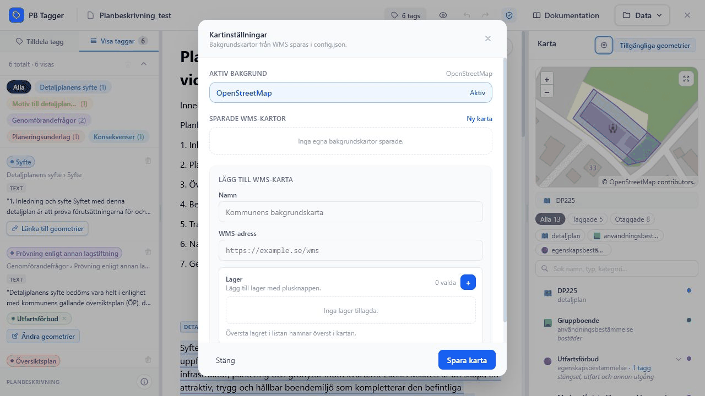

# Felsökning

Den här sidan samlar vanliga problem i arbetsflödet. Börja med den del som matchar vad du försöker göra: läsa in projekt, tagga, länka geometri eller exportera.

## Dokumentet går inte att läsa in

Kontrollera att filen är en giltig `.docx` och inte en äldre `.doc`-fil. Om dokumentet kommer från Word, testa att öppna och spara om det som `.docx`.

Om felet kommer när du ersätter dokument i ett befintligt projekt, prova först att skapa ett nytt testprojekt med samma DOCX. Då ser du om problemet ligger i filen eller i kombinationen av dokument och befintliga taggar.

## Geometri-JSON går inte att importera

Kontrollera att filen är giltig JSON och följer det detaljplan-format som appens parser stödjer. Om projektet skapades ändå kan du importera geometri senare via **Data**.

Efter import ska kartpanelen visa geometrier och filterchips. Om kartan fortfarande säger **Ingen JSON-geometri inläst** lästes filen inte in.

## Taggar syns inte i dokumentet

Kontrollera ögonknappen i toppbaren. När taggar är dolda visas bara den valda taggen.

Om en viss tagg saknas:

1. Gå till **Visa taggar**.
2. Välj **Alla** i temafiltret.
3. Klicka på taggen i listan.
4. Kontrollera om dokumentet scrollar till markeringen.

Om taggen finns i listan men inte går att hitta i dokumentet kan dokumentet ha ersatts med en version där texten inte matchar tidigare positioner.

## Sidopanelen visar inte Tilldela tagg

Sidopanelen växlar till **Tilldela tagg** när du markerar nytt innehåll. Om den inte växlar:

- kontrollera att du markerar text i dokumentvyn, inte i sidopanelen
- släpp musen inom dokumentytan efter markeringen
- klicka på en bild, ett diagram eller en tabell om du vill tagga ett objekt
- klicka i ett tomt område i dokumentet för att avmarkera en vald befintlig tagg och försök igen

## Dokumentsökning hittar inga träffar

Kontrollera stavning och att du söker i dokumentvyns sökfält, inte i kategorisökningen i sidopanelen.

*Dokumentsökningen visar träffräknare och navigering mellan matchningar.*

## Export av taggad DOCX blockeras

Öppna Planbeskrivning-statusen och kontrollera vilka fel som finns. Om du behöver skapa en fil trots fel kan du ändra exportinställningen från **Blockera vid fel** till **Tillåt med fel**.

*Exportkontrollen visar vilka taggar som behöver granskas före export.*

Åtgärda i första hand röda fel. Gula varningar bör granskas, men blockerar normalt inte export om inga röda fel finns.

## Länkade GML-geometrier går inte att avlänka

GML från importerad DOCX visas som skrivskyddad kontroll. Redigera geometri-länkar i JSON-läget genom att importera eller använda detaljplan-JSON.

Om du behöver ändra länkar:

1. Importera detaljplan-JSON via **Data**.
2. Gå till **Visa taggar**.
3. Klicka **Ändra geometrier** eller **Länka till geometrier**.
4. Välj geometrier i JSON-läget.
5. Klicka **Länka**.

## Geometri-länkning sparas inte

Kontrollera att du klickar **Länka** i bekräftelseraden längst ner i kartpanelen. Om du klickar **Avbryt** eller lämnar länkningsläget sparas inte de markerade kryssrutorna.

*Länkningsläget visar valda geometrier först när du bekräftar med **Länka**.*

## Sparade projekt saknas

Projektgalleriet bygger på webbläsarens IndexedDB. Projekt kan saknas om du använder en annan webbläsare, annan profil, inkognitoläge eller om webbläsardata har rensats. Exportera `.pbproject` för långsiktig lagring.

*Om projektgalleriet är tomt kan du skapa ett nytt projekt eller importera en sparad `.pbproject`.*

## Kartbakgrund visas inte

Kontrollera att eventuell WMS-konfiguration har rätt URL och lager. Exportera `config.json` innan du byter miljö om bakgrundskartor behöver följa med.

*Kartinställningar visar aktiv bakgrund, sparade WMS-kartor och formuläret för nya lager.*

Kontrollera också:

- att WMS-adressen börjar med `http://` eller `https://`
- att minst ett lager finns i listan
- att lagernamnet är exakt samma som i WMS-tjänsten
- att tjänsten tillåter webbläsaranrop från appens miljö

## Data-menyn visar felmeddelande

Röda statusmeddelanden från Data-menyn betyder att import eller export misslyckades. Vanliga orsaker är:

| Åtgärd | Vanlig orsak |
| --- | --- |
| Ersätt dokument | Filen är inte en giltig `.docx`. |
| Importera geometri | Filen är inte giltig JSON eller har oväntad struktur. |
| Exportera taggat dokument | Planbeskrivning-kontrollen hittar fel eller dokumentmodellen saknas. |
| Exportera taggar | En länkad geometri kan inte konverteras till GeoJSON. |
| Importera config | `config.json` följer inte appens förväntade format. |

Stäng inte felrutan direkt om du behöver rapportera problemet. Texten kan innehålla den viktigaste ledtråden.
