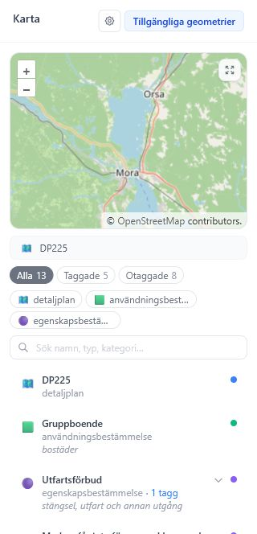

# Geometri och karta

Kartpanelen visar geometrier från importerad detaljplan-JSON eller från Planbeskrivning GML i en importerad DOCX. Panelen används både för kontroll och för att länka taggar till geometrier.

*Kartpanelen visar geometrier, filter, sökning och kopplingar mellan taggar och objekt.*

## Panelens delar

Kartpanelen består av:

- knapp för **Kartinställningar**
- lägesknapp för tillgängliga JSON-geometrier eller dokumentkontroll
- karta med bakgrundskarta och planobjekt
- knapp för maximerad karta
- information om aktiv geometri-JSON
- filter för taggstatus
- filter för geometrityp
- sökfält för geometrier
- lista med geometriobjekt och länkade taggar

## Importera geometri

Geometri kan importeras när projektet skapas eller senare via **Data** > **Importera geometri (.json)**.

Den importerade JSON-filen sparas som ett geometri-dokument. Appen behåller originalformatet för att kunna exportera samma geometri igen.

Efter import visas geometrierna i kartan och i listan. Om JSON-filen innehåller detaljplansreferens används den även som förslag i Planbeskrivning v2.0-metadata.

## Lägen i kartpanelen

Kartpanelen kan visa:

- JSON-geometrier från importerad detaljplan-JSON.
- GML-geometrier som hittats i en importerad DOCX med Planbeskrivning XML.

När JSON-geometrier finns används de som huvudkälla för redigerbara länkar. GML-lagret fungerar främst som kontroll av det som finns inbäddat i dokumentet.

| Läge | Användning | Går att redigera? |
| --- | --- | --- |
| Tillgängliga geometrier | Arbeta med importerad detaljplan-JSON och skapa länkar. | Ja |
| Dokumentkontroll | Kontrollera GML-geometrier som följde med DOCX-filen. | Nej, visas som kontroll |

När du startar länkning växlar appen alltid till JSON-läget, eftersom länkar sparas mot redigerbara JSON-geometrier.

## Söka och filtrera geometrier

Geometrilistan kan filtreras på:

- geometri- eller objekttyp
- taggad eller otaggad status
- fritext i namn, typ, kategori och bestämmelseformulering

Klick i listan markerar motsvarande objekt på kartan. Klick i kartan markerar motsvarande rad i listan.

Använd filtren så här:

1. Välj **Alla**, **Taggade** eller **Otaggade** för att kontrollera arbetsläget.
2. Välj en eller flera geometrityper om listan är lång.
3. Skriv i sökfältet för att hitta namn, typ, kategori eller bestämmelseformulering.
4. Klicka på en rad för att markera objektet på kartan.
5. Expandera en geometri med länkade taggar för att se vilka taggar som pekar på den.

## Länka tagg till geometri

1. Gå till **Visa taggar** i sidopanelen.
2. Klicka på länkknappen för en tagg.
3. Kartpanelen går in i länkningsläge.
4. Kryssa i en eller flera geometrier i listan eller klicka på objekt i kartan.
5. Klicka på **Länka** för att spara kopplingarna.

En tagg kan kopplas till flera geometrier. Vid länkning redigeras JSON-kopplingar. GML-kopplingar som importerats från DOCX visas för kontroll men hanteras som skrivskyddade.

*I länkningsläge visas en blå instruktion, kryssrutor i geometrilistan och en bekräftelserad längst ner.*

## Ändra eller ta bort geometri-länkar

Om en tagg redan har geometrier visas knappen **Ändra geometrier**. Den öppnar samma länkningsläge, men befintliga JSON-geometrier är redan markerade.

Du kan avlänka en enskild geometri direkt från taggkortet eller från en expanderad geometri i kartpanelen. Avlänkning är bara aktiv för JSON-länkar. Om länken kommer från DOCX-GML visas den som kontroll och kan inte tas bort i appen.

## Maximera karta

Kartpanelen kan visas större i ett modal-läge. Det är användbart när geometrier överlappar eller när du vill göra flera länkar med mer kartutrymme.

## Bakgrundskartor

Bakgrundskartor hanteras i **Kartinställningar** och sparas i appens `config.json`. Standardläget använder inbyggd OpenStreetMap-bakgrund om ingen WMS-bakgrund är vald.

*Kartinställningar låter dig välja OpenStreetMap, lägga till WMS-kartor och spara lager i `config.json`.*

### Ändra aktiv bakgrundskarta

1. Öppna kartpanelen.
2. Klicka på knappen **Kartinställningar**.
3. Välj **OpenStreetMap** eller en sparad WMS-karta under **Aktiv bakgrund**.

Valet sparas i projektets `config.json` och följer med när projektet exporteras som `.pbproject`.

### Lägg till en ny WMS-karta

1. Öppna **Kartinställningar** i kartpanelen.
2. Gå till **Lägg till WMS-karta**.
3. Fyll i **Namn**, till exempel kommunens baskarta.
4. Fyll i **WMS-adress**. Adressen måste börja med `http://` eller `https://`.
5. Klicka på plusknappen för att lägga till ett lager.
6. Lägg till lager på något av följande sätt:
   - Skriv ett lagernamn i **Nytt lagernamn** och klicka på **Lägg till**.
   - Klicka på **Hämta lager från WMS**, sök fram lagret och välj det i listan.
7. Upprepa om WMS-tjänsten ska använda flera lager.
8. Ordna lagren med upp- och nedknapparna. Det översta lagret ritas överst i kartan.
9. Klicka på **Spara karta**.
10. Välj den sparade WMS-kartan under **Aktiv bakgrund** om den inte redan är vald.

När en WMS-karta sparas hamnar den i projektets `config.json`. Exportera `config.json` om samma bakgrundskartor ska användas i fler projekt.

### Redigera eller ta bort WMS-kartor

Sparade WMS-kartor visas under **Sparade WMS-kartor**. Där kan du klicka på **Redigera** för att ändra namn, adress eller lager, eller **Ta bort** för att radera kartan från projektets konfiguration.

Om du tar bort den aktiva WMS-kartan växlar appen tillbaka till OpenStreetMap.

### Felsökning för WMS

- Kontrollera att WMS-adressen är en fullständig `http://`- eller `https://`-adress.
- Minst ett lagernamn måste vara valt innan kartan kan sparas.
- Om **Hämta lager från WMS** inte hittar lager kan du skriva lagernamnet manuellt.
- Om WMS-tjänsten inte visas i webbläsaren kan tjänstens åtkomstregler eller CORS-inställningar behöva kontrolleras.
