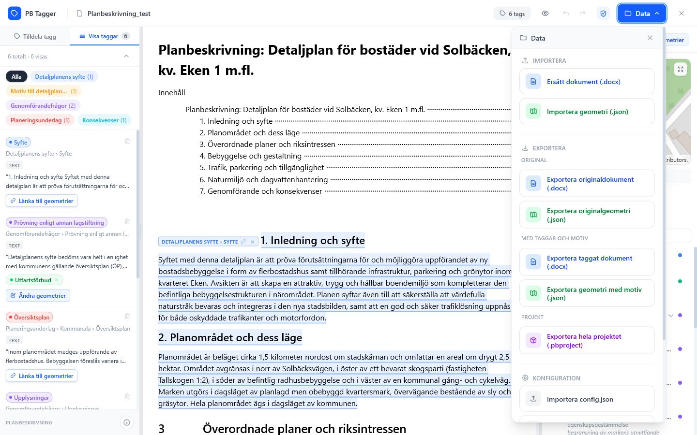

# Import och export

Alla import- och exportåtgärder i editorläget finns i toppbarens **Data**-meny.

*Datamenyn samlar import, export, projektfil, konfiguration och exportinställningar.*

## Importera

| Åtgärd | Resultat |
| --- | --- |
| **Ersätt dokument (.docx)** | Byter dokument i projektet och försöker behålla befintliga taggar och geometri-länkar. |
| **Importera geometri (.json)** | Läser in detaljplan-JSON och visar geometrier i kartpanelen. |
| **Importera config.json** | Läser in kartinställningar och andra projektinställningar. |

När ett dokument ersätts läser appen även eventuell Planbeskrivning XML/GML från den nya DOCX-filen.

## Exportera original

| Åtgärd | Resultat |
| --- | --- |
| **Exportera originaldokument (.docx)** | Laddar ner den inlästa Word-filen utan nya taggar. |
| **Exportera originalgeometri (.json)** | Laddar ner geometri-dokumentet i originalformat. |

## Exportera med taggar och motiv

| Åtgärd | Resultat |
| --- | --- |
| **Exportera taggat dokument (.docx)** | Skapar en DOCX med innehållskontroller, bokmärken, taggmetadata och Planbeskrivning v2.0-data. |
| **Exportera geometri med motiv (.json)** | Skapar en kopia av geometri-JSON där länkade motiv skrivs in i planbestämmelser. |

Export av taggad DOCX kan blockeras om Planbeskrivning v2.0-kontrollen hittar fel och inställningen **Blockera vid fel** är aktiv.

## Exportera projekt

**Exportera hela projektet (.pbproject)** laddar ner en ZIP-baserad projektfil som innehåller:

- `document.docx`
- `project.json`
- `config.json`
- `geometry_doc.json`, om geometri har importerats

Använd `.pbproject` när du vill arkivera arbetet eller flytta det till en annan webbläsare eller dator.

## Exportera och importera config

`config.json` innehåller appens projektkonfiguration, framför allt kartinställningar och sparade WMS-bakgrunder. Den kan exporteras separat och importeras i ett annat projekt när samma bakgrundskartor ska återanvändas.
