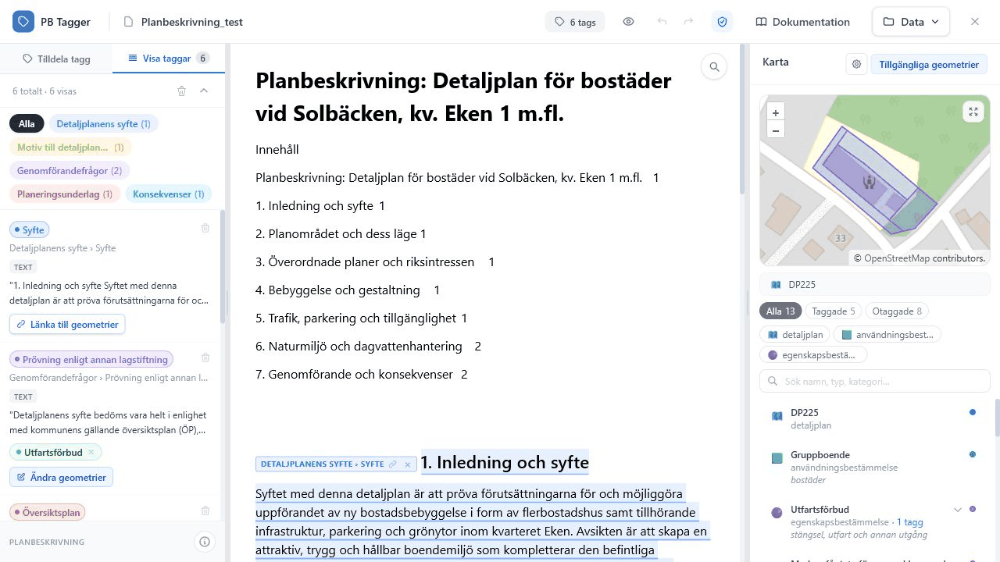

# Användarmanual

Manualen beskriver de vanligaste arbetsflödena i Planbeskrivning Tagger. Den är skriven för personer som arbetar med att märka upp planbeskrivningar, kontrollera kopplingar mot geometri och ta fram filer för fortsatt hantering.

*Editorläget visar tagglistan till vänster, dokumentet i mitten och kart-/geometripanelen till höger.*

## Gränssnittets delar

Planbeskrivning Tagger består av sex ytor som används tillsammans under arbetet:

| Del | När du använder den | Manual |
| --- | --- | --- |
| Startvy | Skapa nytt projekt, importera `.pbproject` eller öppna ett sparat projekt. | [Skapa och öppna projekt](projekt.md) |
| Toppbar | Byta projekt, döpa om projektet, se taggantal, dölja taggar, ångra/göra om, öppna dokumentation och Data-menyn. | [Import och export](import-export.md) |
| Dokumentvy | Läsa dokumentet, söka i texten, markera innehåll och kontrollera taggmarkeringar. | [Tagga innehåll](tagga-innehall.md) |
| Sidopanel | Tilldela nya taggar, filtrera befintliga taggar och starta geometri-länkning. | [Tagga innehåll](tagga-innehall.md) |
| Kartpanel | Kontrollera geometrier, filtrera objekt, välja bakgrundskarta och länka taggar. | [Geometri och karta](geometri-karta.md) |
| Data-menyn | Importera, exportera, hantera `config.json` och redigera Planbeskrivning v2.0-inställningar. | [Import och export](import-export.md) |

## Rekommenderat arbetsflöde

1. Skapa eller öppna ett projekt.
2. Kontrollera att dokumentet, tabeller, bilder och eventuella befintliga taggar visas rimligt.
3. Importera geometri eller kontrollera GML som följde med DOCX-filen.
4. Tagga relevanta textavsnitt, bilder, diagram och tabeller.
5. Granska tagglistan och rensa bort felaktiga taggar.
6. Länka taggar till geometrier i kartpanelen.
7. Kontrollera Planbeskrivning v2.0-status och metadata.
8. Exportera taggad DOCX, geometri med motiv eller hela projektet.

!!! tip "Arbeta i korta kontrollsteg"
    Exportera gärna hela projektet som `.pbproject` när du har kommit igenom en större del av taggningen. Då kan arbetet flyttas eller återställas även om webbläsarens lokala lagring rensas.

## Bilder i manualen

Manualen använder screenshots för varje huvuddel av appen. Bilderna visar inte bara var knappen finns, utan också vilket läge appen hamnar i efter att åtgärden har startats.

| Bild | Visar |
| --- | --- |
| { width="220" } | Startvy, dokumentationslänk och projektgalleri. |
| { width="220" } | Filtrering, taggkort, rensa alla taggar och geometriåtgärder. |
| { width="220" } | Taggmarkeringar och objektbadges i dokumentet. |
| { width="220" } | Karta, filter, sökning och geometri-lista. |
| { width="220" } | Import, export, config och exportinställningar. |

## Manualens delar

| Sida | Innehåll |
| --- | --- |
| [Skapa och öppna projekt](projekt.md) | Nytt projekt, sparade projekt och `.pbproject`. |
| [Tagga innehåll](tagga-innehall.md) | Text, bild, diagram, tabell, kategorier och noteringar. |
| [Geometri och karta](geometri-karta.md) | Kartpanelen, filter, sökning och geometri-länkning. |
| [Import och export](import-export.md) | Dokument, geometri, config och projektfiler. |
| [Planbeskrivning v2.0](planbeskrivning-v2.md) | Metadata, compliance och `omfattningar.xml`. |
| [Felsökning](felsokning.md) | Vanliga problem och kontroller. |
