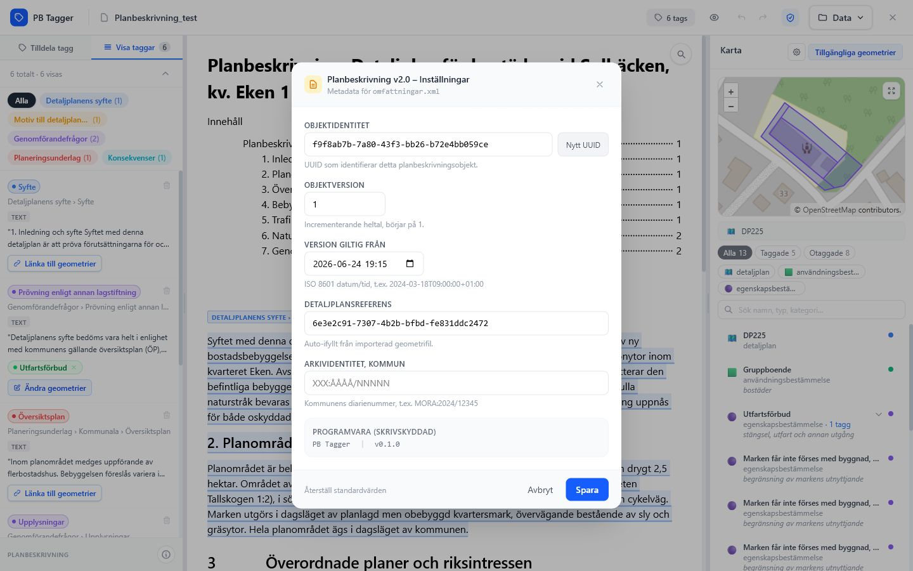

# Planbeskrivning v2.0

Appen kan bädda in Planbeskrivning v2.0-data i den taggade DOCX-exporten. Exporten skapar eller uppdaterar en custom XML-del med `omfattningar.xml`.

## Statusindikator

Toppbaren visar en statusindikator för Planbeskrivning-exporten. Den hjälper dig att se om taggar och kopplingar uppfyller de krav som appen kontrollerar.

## Exportinställningar

I **Data** > **Exportinställningar** finns:

- **Planbeskrivning v2.0**: visar att `omfattningar.xml` alltid inkluderas vid taggad DOCX-export.
- **Blockera vid fel / Tillåt med fel**: styr om export ska stoppas när compliance-fel finns.
- **Redigera metadata**: öppnar inställningar för Planbeskrivning-metadata.

## Metadata

Metadata-panelen innehåller:

*Metadata-panelen styr värdena som skrivs till Planbeskrivning v2.0-exporten.*

| Fält | Beskrivning |
| --- | --- |
| Objektidentitet | UUID för planbeskrivningsobjektet. |
| Objektversion | Versionstal, normalt med start på `1`. |
| Version giltig från | Datum och tid för versionens giltighet. |
| Detaljplansreferens | UUID till detaljplanen, ofta autoifyllt från geometriimporten. |
| Arkividentitet, kommun | Kommunens diarienummer eller arkivreferens. |
| Programvara | Skrivskyddad information om appen. |

## Geometri från DOCX

När en DOCX redan innehåller Planbeskrivning XML kan appen läsa ut GML-geometrier. De visas i kartpanelen som dokumentkontroll och kan speglas mot taggar, men direkta länkar redigeras i JSON-läget.

## Compliance-läge

Med **Blockera vid fel** stoppas export om appens validering hittar fel. Med **Tillåt med fel** kan exporten genomföras även när fel finns, men resultatet bör kontrolleras extra noggrant.
