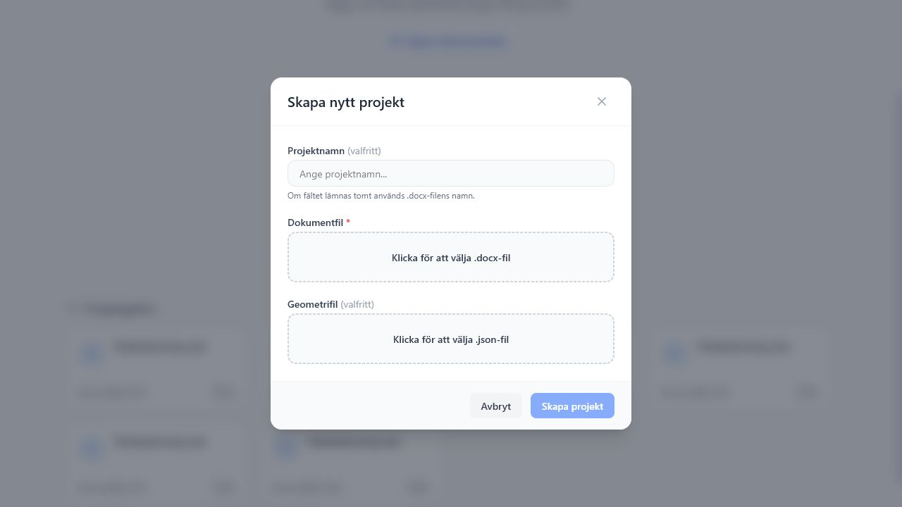

# Skapa och öppna projekt

Startvyn samlar projektåtgärder och tidigare sparade projekt. Ett projekt består av den inlästa Word-filen, taggar, geometrier, kartinställningar och exportmetadata.

*Startvyn samlar dokumentationslänk, nytt projekt, import av projektfil och lokalt sparade projekt.*

## När startvyn visas

Startvyn visas när inget projekt är öppet. Här kan du:

- öppna dokumentationen i en ny flik
- skapa ett nytt projekt från en `.docx`
- importera en tidigare exporterad `.pbproject`
- öppna ett projekt som redan finns i webbläsarens lokala lagring
- ta bort lokala projekt som inte längre behövs

Projektgalleriet bygger på IndexedDB i den aktuella webbläsaren. Det betyder att listan kan se olika ut i Chrome, Edge, Firefox, inkognitoläge eller en annan användarprofil.

## Skapa nytt projekt

1. Klicka på **Skapa projekt**.
2. Välj **Skapa nytt projekt** i menyn.
3. Ange ett projektnamn om du vill. Om fältet lämnas tomt används `.docx`-filens namn.
4. Välj en `.docx`-fil. Den är obligatorisk.
5. Välj en geometri-JSON om du vill läsa in geometrier direkt.
6. Klicka på **Skapa projekt**.

*Dialogen för nytt projekt samlar projektnamn, obligatorisk `.docx` och valfri geometri-JSON.*

När projektet skapas läser appen dokumentet, bygger dokumentvyn och sparar projektet lokalt i webbläsarens IndexedDB. Om DOCX-filen redan innehåller Planbeskrivning XML läser appen även in befintliga taggar, metadata och GML-geometrier.

!!! note "Geometri kan läggas till senare"
    Om du inte har detaljplan-JSON när projektet skapas kan du fortsätta med dokumentet och importera geometri senare via **Data** > **Importera geometri (.json)**.

*Projektmenyn låter dig välja mellan nytt projekt och import av `.pbproject`.*

## Importera existerande projekt

1. Klicka på **Skapa projekt**.
2. Välj **Importera existerande projekt**.
3. Välj en `.pbproject`-fil.

En `.pbproject` innehåller dokumentet, taggar, geometrier, aktiv geometri och appkonfiguration. Den är avsedd för att flytta eller arkivera ett pågående arbete.

Efter import öppnas projektet direkt i editorläget. Kontrollera särskilt att:

- projektnamnet är rätt i toppbaren
- taggantalet i toppbaren verkar rimligt
- kartpanelen visar väntad geometri
- eventuella WMS-bakgrunder finns kvar under **Kartinställningar**

## Öppna sparat projekt

Tidigare projekt visas i **Projektgalleri** på startvyn. Klicka på ett projektkort för att öppna det.

Projektkortet visar projektnamn, uppdateringstid och antal taggar. När du hovrar över kortet visas mer statistik, bland annat antal geometrier.

## Byta eller döpa om projekt

När ett projekt är öppet visas projektnamnet i toppbaren.

1. Klicka på projektnamnet i toppbaren.
2. Skriv ett nytt namn.
3. Tryck `Enter` eller klicka utanför fältet för att spara.
4. Tryck `Escape` om du vill avbryta namnändringen.

Namnet får inte vara tomt. Om ett annat lokalt projekt redan använder samma namn visar appen ett fel och behåller redigeringsfältet öppet.

För att gå tillbaka till startvyn klickar du på **PB Tagger** eller kryssknappen längst till höger i toppbaren. Projektet ligger kvar i lokal lagring.

## Ta bort projekt

Klicka på papperskorgen på ett projektkort och bekräfta borttagningen. Åtgärden tar bort den lokala kopian från webbläsaren.

!!! warning "Exportera innan du rensar"
    Om projektet behöver sparas utanför webbläsaren, exportera först hela projektet som `.pbproject`.

## Rekommenderad lagringsrutin

| Situation | Rekommenderad åtgärd |
| --- | --- |
| Du arbetar vidare på samma dator och webbläsare | Öppna projektet från projektgalleriet. |
| Du vill arkivera arbetet | Exportera **hela projektet (.pbproject)**. |
| Du ska flytta arbetet till en annan dator | Exportera `.pbproject` och importera den i den andra miljön. |
| Du vill återanvända kartinställningar men inte dokumentet | Exportera och importera `config.json`. |
