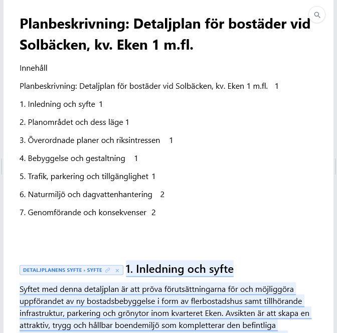
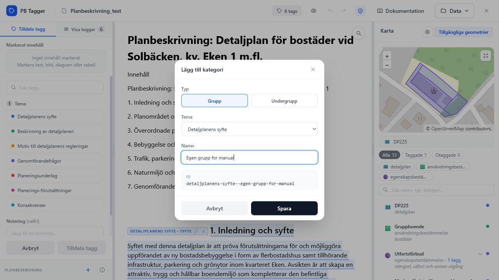
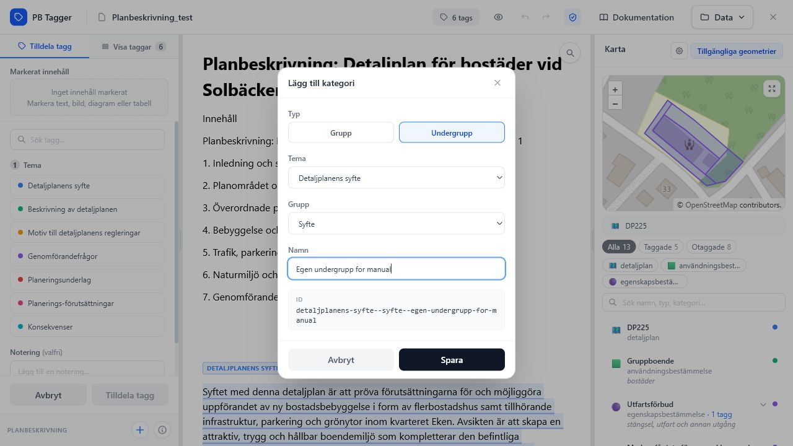

# Tagga innehåll

Taggning görs från dokumentvyn och sidopanelen. Dokumentet är skrivskyddat i appen; du markerar innehåll men redigerar inte själva texten.

*Taggat innehåll markeras direkt i den skrivskyddade dokumentvyn.*

## Innan du börjar tagga

Kontrollera först att dokumentet ser rimligt ut i dokumentvyn:

- rubriker och innehållsförteckning ligger i rätt ordning
- tabeller visas som tabeller
- bilder och diagram visas eller ersätts med tydliga platshållare
- eventuella taggar från en importerad DOCX visas med färgmarkering eller badge

Om något ser fel ut, testa att öppna originalfilen i Word och spara om den som `.docx` innan du fortsätter.

## Tagga text

1. Markera text i dokumentet.
2. Sidopanelen växlar till **Tilldela tagg**.
3. Välj **Tema**.
4. Välj **Grupp**.
5. Välj eventuell **Undergrupp**.
6. Lägg till en notering om det behövs.
7. Klicka på **Tilldela tagg**.

Om markeringen sträcker sig över flera stycken skapas en sammanhängande tagg som behåller start- och slutposition i dokumentmodellen.

När taggen sparas händer tre saker:

- markeringen får temats färg i dokumentet
- taggen läggs till i **Visa taggar**
- projektet sparas lokalt i webbläsaren

!!! tip "Markera hellre hela motivet"
    Försök markera den text som faktiskt motiverar eller beskriver planbestämmelsen. Korta ord eller rubrikfragment kan bli svåra att förstå i export och vid geometri-länkning.

## Tagga bild, diagram eller tabell

Klicka på en bild, ett diagram eller en tabell i dokumentet. Sidopanelen visar objektet som markerat innehåll och du tilldelar kategori på samma sätt som för text.

Objekttaggar visas med en badge i dokumentvyn. Badgen kan användas för att välja taggen, länka geometri eller ta bort taggen.

| Objekt | Så väljer du det | Så visas taggen |
| --- | --- | --- |
| Bild | Klicka på bilden i dokumentet. | Bilden får markerad ram och badge. |
| Diagram | Klicka på diagrammet eller platshållaren. | Diagrammet får badge med kategorin. |
| Tabell | Klicka i tabellen utan att markera text. | Hela tabellen taggas som objekt. |

## Söka kategori

I **Tilldela tagg** kan du söka efter kategori. Sökningen matchar tema, grupp, undergrupp och den sammansatta kategoritexten.

Sök är snabbast när du vet ungefär vilken grupp du vill använda. Om du inte vet det, välj först tema och bläddra sedan bland grupper och undergrupper.

## Lägga till egen grupp eller undergrupp

I **Tilldela tagg** kan du klicka på plusknappen längst ner i sidopanelen för att skapa en egen kategori i projektet.

*När **Grupp** är vald väljer du tema, skriver namn och kontrollerar det ID som appen föreslår.*

1. Välj om du vill skapa **Grupp** eller **Undergrupp**.
2. Välj befintligt **Tema**.
3. Välj **Grupp** om du skapar en undergrupp.
4. Skriv namn och kontrollera det föreslagna ID:t.
5. Klicka på **Spara**.

*När **Undergrupp** är vald väljer du först tema och befintlig grupp. Den nya undergruppen skapas under den valda gruppen.*

Den nya gruppen eller undergruppen väljs direkt och går att använda i taggning och sökning. Egna kategorier sparas i projektets `config.json` och följer med vid export/import av projekt eller konfiguration.

!!! note "Egna teman stöds inte"
    Appen låter dig lägga till grupper och undergrupper under befintliga teman. Nya teman skapas inte i gränssnittet.

## Importera egna taggkategorier

I **Tilldela tagg** kan du importera kategoridelen från en befintlig `config.json`. Importen ersätter bara projektets egna taggkategorier och lämnar WMS-inställningar, dokument, taggar och geometrier oförändrade.

Använd Data-menyns **Importera config.json** om du i stället vill ersätta hela projektkonfigurationen.

## Visa och filtrera taggar

Fliken **Visa taggar** listar alla taggar i dokumentordning. Du kan filtrera på tema och klicka på en tagg för att:

- markera den i dokumentet
- se kopplade geometrier
- starta geometri-länkning
- ta bort taggen
- rensa alla taggar via papperskorgen i panelens överkant

*Sidopanelen visar taggar, temafilter och geometriåtgärder i dokumentordning.*

Taggkortet visar kategori, typ av markerat innehåll, textutdrag, eventuell notering och kopplade geometrier. Om en tagg är vald visas dess UUID längst ner på kortet som felsökningshjälp.

## Ta bort en eller alla taggar

1. Gå till **Visa taggar**.
2. Leta upp taggen i listan eller klicka på markeringen i dokumentet.
3. Klicka på papperskorgen på taggkortet.

Taggen tas bort från dokumentvyn, tagglistan och exportunderlaget. Om taggen hade geometri-länkar tas även dessa länkar bort från taggen.

För att rensa hela dokumentets taggning klickar du på papperskorgen i **Visa taggar**-panelens överkant och bekräftar. Då tas alla taggar, markeringar och deras geometri-länkar bort, medan dokumentet och importerade geometrier finns kvar. Åtgärden kan ångras med appens vanliga ångra-funktion.

## Söka i dokumentet

Dokumentvyn har en egen sökfunktion uppe till höger. Den påverkar inte taggarna utan hjälper dig att hitta text i dokumentet.

*Sökfältet visar antal träffar och låter dig hoppa mellan dem utan att lämna dokumentvyn.*

1. Klicka på förstoringsglaset eller tryck `Ctrl+F`.
2. Skriv söktext.
3. Tryck `Enter` för nästa träff.
4. Tryck `Shift+Enter` för föregående träff.
5. Tryck `Escape` för att stänga sökningen.

## Dölja och visa taggmarkeringar

Ögonknappen i toppbaren växlar om alla taggmarkeringar visas i dokumentet. Om markeringarna är dolda visas fortfarande den valda taggen.

Det är användbart när du vill läsa dokumentet utan färgmarkeringar men ändå kontrollera en enskild tagg från listan.

## Ångra och gör om

Toppbaren innehåller knappar för ångra och gör om. Kortkommandon stöds också:

- `Ctrl+Z` för ångra
- `Ctrl+Y` eller `Ctrl+Shift+Z` för gör om

Ångra/gör om gäller arbetsmoment i projektet, till exempel nya taggar, borttagna taggar och ändrade geometri-länkar.
